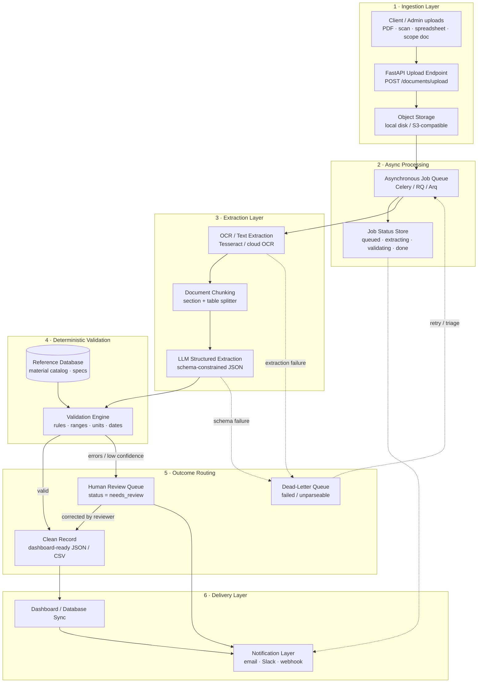

# System Architecture

> **Self-built production-style demo — Pulse Method.** The diagram below is the
> *production target architecture*. This repository implements the core path
> end-to-end (ingestion → status tracking → simulated extraction → deterministic
> validation → outcome routing → result retrieval). The components marked
> *"extension point"* are designed-in but stubbed for the local demo so it runs
> fully offline with no external services or credentials.

## Pipeline diagram

## Layer-by-layer

**1 · Ingestion Layer.** A document enters through a single typed endpoint. The
raw bytes are persisted to storage and a job is created in `queued` state. In the
demo, ingestion is `POST /documents/upload` (multipart) or `POST /documents/demo`
(bundled sample), and "storage" is the in-memory job record.

**2 · Async Processing.** Real documents are slow (OCR + LLM latency), so work is
decoupled from the request via a job queue, and every job carries a status that a
caller can poll. The demo implements the **job status store** with a full stage
history (`queued → extracting → validating → completed / needs_review / failed`);
the distributed queue itself is an *extension point* — the demo runs the pipeline
inline so it is trivial to follow.

**3 · Extraction Layer.** Three sub-steps: OCR turns pixels into text; chunking
splits the text into sections and tables so the model gets focused context;
the LLM returns **schema-constrained JSON** (function-calling / JSON mode). In the
demo, OCR is simulated by reading the uploaded text layer, and the LLM step is a
**deterministic local simulator** (`app/extraction.py`) that returns the exact
same typed `ExtractedDocument` a real model would — including per-field
confidence — with zero network calls.

**4 · Deterministic Validation.** This is the trust layer and it is fully real in
the demo (`app/validation.py`). Extraction is probabilistic; validation is not.
Every extracted material code, unit, quantity, dimension, deadline, and
compliance note is checked against explicit rules and the **Reference Database**
(`app/reference_data.py`). Same input → same findings, every time.

**5 · Outcome Routing.** Based on validation, a job is routed one of three ways:
clean records go to the **clean output**; records with errors or low confidence go
to the **human review queue** (`status = needs_review`); unrecoverable failures go
to the **dead-letter queue** (`status = failed` with a captured reason, so nothing
is silently lost). All three are implemented.

**6 · Delivery Layer.** Clean records sync to a dashboard/database and stakeholders
are notified. These are *extension points* in the demo — the clean record is
returned from `GET /documents/{job_id}/result`, ready to sync or flatten to CSV.

## What the demo implements vs. the production target

| Layer | In this demo | Production target |
|---|---|---|
| Upload endpoint | ✅ Implemented (FastAPI) | Same |
| Storage | In-memory record | S3 / blob storage |
| Job queue | Inline run + status store | Celery / RQ / Arq + Redis |
| Job status tracking | ✅ Implemented (stage history) | Same, persisted |
| OCR / text layer | Simulated (reads text layer) | Tesseract / cloud OCR |
| Chunking | Section/table heuristics | Same, model-tuned |
| LLM extraction | ✅ Deterministic simulator | LLM w/ JSON-mode + retries |
| Deterministic validation | ✅ Fully implemented | Same, client rules |
| Reference database | ✅ In-memory catalog | Postgres / ERP export |
| Dead-letter queue | ✅ `failed` + reason | DLQ topic + alerting |
| Human review queue | ✅ `needs_review` routing | Review UI + assignment |
| Dashboard / DB sync | Result endpoint | Warehouse / dashboard sync |
| Notifications | Extension point | Email / Slack / webhook |

This separation is deliberate: the parts that prove **engineering judgment**
(typed contracts, deterministic validation, status/lifecycle, dead-letter and
review routing, structured logging) are real and tested; the parts that are pure
**infrastructure wiring** are designed-in and clearly labeled so the demo stays
runnable in one command.
