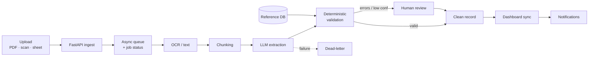

# Portfolio Asset — One-Page Overview

This single document indexes the whole package and inlines the ready-to-use copy, so
you can move fast without opening ten files. The full versions live in the repo.

> **Honesty contract (applies everywhere):** this is a **self-built, production-style
> demo** by Pulse Method. No real clients, no claimed savings or accuracy numbers, no
> production deployment. The code is real, runs locally, and is tested. Pulse Method
> builds operations / document-automation systems and does **not** provide licensed
> engineering services.

---

## What's in the package

| # | Deliverable | File |
|---|---|---|
| 1 | Portfolio case study (short + long) | [`docs/CASE_STUDY.md`](docs/CASE_STUDY.md) |
| 2 | System architecture (Mermaid diagram) | [`docs/ARCHITECTURE.md`](docs/ARCHITECTURE.md) |
| 3 | Production-style Python backend (FastAPI + Pydantic v2) | [`app/`](app/) |
| 4 | Sample data (input, reference, schema, outputs) | [`sample_data/`](sample_data/) |
| 5 | GitHub-ready README | [`README.md`](README.md) |
| 6 | Upwork packaging guide | [`docs/UPWORK_PACKAGING.md`](docs/UPWORK_PACKAGING.md) |
| 7 | 60-second client explanation | [`docs/CLIENT_EXPLANATION.md`](docs/CLIENT_EXPLANATION.md) |
| 8 | Proposal insert | [`docs/PROPOSAL_INSERT.md`](docs/PROPOSAL_INSERT.md) |
| — | Test suite | [`tests/`](tests/) |

**Verified:** the API boots, the full upload → process → status → result flow works, and
all 7 tests pass. The seeded sample document correctly produces a `needs_review` result
with 3 errors, 3 warnings, 1 info; a clean document produces a `completed` result with
zero issues.

---

## The 30-second pitch

It turns messy project documents into clean, validated, dashboard-ready data — and
knows when to ask a human. The trick is the split between a **probabilistic extraction**
step (OCR + LLM, simulated here) and a **deterministic validation** step that checks
every field against a reference catalog and explicit rules. Automate the routine
documents; escalate only the exceptions.

---

## Run it (proof it's real)

```bash
pip install -r requirements.txt
uvicorn app.main:app --reload          # then open http://127.0.0.1:8000/docs
pytest                                  # 7 passing tests
```

```bash
# try the whole pipeline on the bundled sample
curl -X POST http://127.0.0.1:8000/documents/demo            # -> job_id
curl -X POST http://127.0.0.1:8000/documents/<job_id>/process
curl http://127.0.0.1:8000/documents/<job_id>/result
```

---

## Architecture at a glance



Full diagram with every layer and an implemented-vs-target table:
[`docs/ARCHITECTURE.md`](docs/ARCHITECTURE.md).

---

## Ready-to-paste copy

### Upwork portfolio title
> **Document Intelligence Pipeline — AI Extraction + Validation (Self-Built Demo)**

### Upwork portfolio description (short)
> Self-built, production-style demo: messy project document in → clean, validated,
> dashboard-ready data out. Extracts project IDs, materials, quantities, units,
> dimensions, deadlines, compliance notes, and risk flags, then runs a **deterministic
> validation** pass against a reference catalog and rule set. Clean records pass through;
> bad data (unknown codes, impossible quantities, wrong units, inconsistent dates) is
> auto-flagged and routed to human review with an exact fix list. FastAPI + Pydantic v2,
> async, structured logging, custom exceptions, job-status tracking, dead-letter
> handling, and a test suite. AI extraction simulated locally (no credentials);
> architected to drop in a real OCR + LLM provider. *Designed to* reduce manual
> re-keying time and catch errors at intake. (Demo — no client data, no claimed metrics.)

### Skills to tag (use Upwork's autocomplete)
Python · FastAPI · API Integration · Data Extraction · PDF Conversion · Automation ·
Workflow Automation · Artificial Intelligence · Large Language Model · Data Processing ·
JSON · Data Validation · OCR · Document Processing · ETL

### Best-fit job posts to bid on
PDF data extraction · document automation · AI workflow automation · invoice/form
extraction · construction takeoff / material schedule cleanup · compliance / inspection
report processing · CRM data cleanup · operations dashboard data feed · spreadsheet
automation from documents · Python data-pipeline / API work.

### Honest client message (when you link the demo)
> Quick note: that portfolio piece is a demo I built myself to prove the approach, not a
> past client project — so no client names or savings figures, on purpose. The code is
> real and runs; the AI extraction step is simulated so it works offline, and it's built
> so a real OCR + LLM provider drops straight in. For your project the key part is the
> validation layer: it checks every extracted field against your own data and rules, so
> clean docs flow through and anything questionable gets flagged instead of landing
> wrong in your spreadsheet. Happy to walk through adapting it to your documents.

### Proposal insert (paste into bids)
> I recently built a production-style demo of exactly this workflow — messy documents in,
> structured fields out, then a deterministic validation pass that checks every field
> against a reference list and rules, with anything questionable auto-flagged for review
> instead of saved wrong. Self-built demo (no client data), FastAPI + Pydantic, tested,
> designed to plug into your real [material schedules / invoices / forms]. Happy to show
> it running on a short call.

### 60-second spoken explanation
Full script in [`docs/CLIENT_EXPLANATION.md`](docs/CLIENT_EXPLANATION.md). One-liner:
> "It reads messy project documents, pulls out the key data automatically, and validates
> every field against your own rules so bad data gets flagged before it reaches your
> spreadsheet."

---

## Three screenshots to capture for the portfolio

1. **The architecture diagram** (render `docs/ARCHITECTURE.md` on GitHub or via
   [mermaid.live](https://mermaid.live)) — use as the cover.
2. **Before → after**: messy `sample_data/messy_input.txt` next to the clean
   `output_human_review.json` with its `validation_issues` list. The money shot.
3. **Swagger UI** at `/docs` (or a `pytest` pass) — proof it actually runs.

Details and a 4th optional shot: [`docs/UPWORK_PACKAGING.md`](docs/UPWORK_PACKAGING.md).
