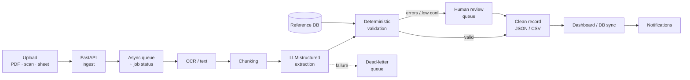

# Autonomous Technical Document Intelligence & Workflow Automation Pipeline

**A self-built, production-style demo by Pulse Method.** It turns messy technical /
project documents into clean, validated, dashboard-ready data — and knows when to
ask a human.

> ⚠️ **This is a demonstration project, not a client case study.** The scenario,
> company, and documents are illustrative. No real client names, revenue savings,
> accuracy figures, or production deployments are claimed. The code is real, runs
> locally, and is tested. Pulse Method builds operations and document-automation
> systems and does **not** provide licensed engineering services.

---

## What this demo does

It runs the pipeline a business would use to stop manually re-keying documents:

1. **Ingest** a document (here, an OCR-style text layer from a material schedule /
   scope note).
2. **Extract** structured fields — project ID, materials, quantities, units,
   dimensions, deadlines, compliance notes, risk flags — each with a confidence score.
3. **Validate** every field *deterministically* against a reference material catalog
   and an explicit rule set.
4. **Route** the result: clean records pass through; records with errors or low
   confidence go to a **human-review queue**; hard failures go to a **dead-letter**
   state with a captured reason.
5. **Deliver** a single clean, typed JSON record, ready to sync to a dashboard, DB,
   or CRM (and trivially flattened to CSV).

The extraction step is **simulated deterministically** so the whole thing runs
offline with **no external credentials** — the architecture is built so a real OCR +
LLM provider drops into the same typed interface.

## Who it's for

Small and mid-sized operations, construction-services, and technical-admin teams
that receive messy PDFs, scans, spreadsheets, scope documents, material schedules,
compliance checklists, and operational reports — and currently retype the important
fields by hand.

## Why it matters

The manual read-and-retype step is slow, doesn't scale with volume, and is where
data-entry errors are born (wrong units, transposed quantities, invalid codes,
inconsistent dates). Those errors then propagate silently into spreadsheets,
dashboards, and procurement. This pipeline is **designed to reduce that manual time
and to catch those errors at intake**, by automating the routine documents and
escalating only the exceptions.

## Architecture

The implemented path is **ingest → status tracking → (simulated) extraction →
deterministic validation → outcome routing → result retrieval**. Infrastructure
pieces (distributed queue, real OCR/LLM, storage, notifications) are designed-in and
clearly labeled as extension points. Full write-up: [`docs/ARCHITECTURE.md`](docs/ARCHITECTURE.md).



## Run it locally

Requirements: Python 3.10+.

```bash
# 1. (optional) create a virtual environment
python -m venv .venv && source .venv/bin/activate     # Windows: .venv\Scripts\activate

# 2. install dependencies
pip install -r requirements.txt

# 3. start the API
uvicorn app.main:app --reload

# 4. open the interactive docs
#    http://127.0.0.1:8000/docs
```

Run the test suite:

```bash
pytest
```

## Example API requests

```bash
# Liveness
curl http://127.0.0.1:8000/health

# See the reference catalog the validator checks against
curl http://127.0.0.1:8000/reference/materials

# Ingest the bundled sample document (no upload needed)
curl -X POST http://127.0.0.1:8000/documents/demo
# -> {"job_id":"<id>","status":"queued", ...}

# ...or upload your own UTF-8 text document
curl -X POST http://127.0.0.1:8000/documents/upload \
     -F "file=@sample_data/messy_input.txt"

# Process the job (runs extraction + validation)
curl -X POST http://127.0.0.1:8000/documents/<job_id>/process
# -> {"status":"needs_review", "requires_human_review":true, ...}

# Poll status + stage history
curl http://127.0.0.1:8000/jobs/<job_id>

# Retrieve the clean, dashboard-ready result
curl http://127.0.0.1:8000/documents/<job_id>/result
```

## Example outputs

Representative outputs live in [`sample_data/`](sample_data/):

| File | What it shows |
|---|---|
| `messy_input.txt` | The raw, OCR-style input (seeded with real-world data problems) |
| `reference_materials.json` | The reference catalog the validator checks against |
| `output_schema.json` | The strict JSON Schema (generated from the Pydantic models) |
| `output_populated.json` | A clean document that validates with **zero errors** (`completed`) |
| `output_human_review.json` | The messy document, correctly extracted but **routed to review** |
| `output_validation_error.json` | A focused view of the field-level validation findings |

A trimmed look at the kind of finding the validation layer produces:

```json
{
  "field_path": "document.materials[8].unit",
  "issue_type": "unit_mismatch",
  "severity": "error",
  "message": "Unit 'BX' is not valid for EMT-34 (Electrical Metallic Tubing 3/4\").",
  "observed": "BX",
  "expected": "One of: FT, LF (default LF).",
  "suggested_action": "Convert the quantity to LF."
}
```

## Repository structure

```
technical-document-intelligence-demo/
├── app/
│   ├── main.py            # FastAPI app + endpoints + exception handlers
│   ├── schemas.py         # Pydantic v2 models (the typed contract)
│   ├── extraction.py      # simulated structured extraction (LLM stand-in)
│   ├── validation.py      # deterministic validation rules engine
│   ├── reference_data.py  # reference material catalog ("source of truth")
│   ├── jobs.py            # job store + pipeline orchestrator + dead-letter
│   ├── exceptions.py      # custom exception hierarchy
│   ├── logging_config.py  # structured JSON logging
│   └── config.py          # settings (env-overridable, no secrets needed)
├── sample_data/           # input, reference data, schema, example outputs
├── docs/                  # case study, architecture, packaging, scripts
├── tests/                 # pytest end-to-end suite
├── requirements.txt
└── README.md
```

## Limitations (deliberate and honest)

- **Extraction is simulated**, not a real LLM/OCR. It deterministically parses the
  demo's text format so the project runs offline and reproducibly. Real documents
  need a real OCR + LLM step (a designed-in extension point).
- **Storage, queue, and notifications are stubbed.** The demo runs the pipeline inline
  and stores jobs in memory; nothing persists across restarts.
- **The reference catalog is small and illustrative.** A real deployment uses the
  client's master list / ERP export.
- **No authentication or rate limiting.** This is a demo API, not a hardened service.
- **No measured performance claims.** Time savings and accuracy depend on a real
  client's documents and rules.

## How it could be extended for a real client

- Swap the simulated extractor for an **LLM with JSON-mode / function calling** plus a
  real **OCR** front-end — same typed `ExtractedDocument` interface.
- Back the queue with **Celery / RQ / Arq + Redis** and persist jobs/results in
  **Postgres**.
- Point the validator at the client's **real reference data** (catalog, specs,
  tolerances, approved-vendor list) and codify their review rules.
- Add a lightweight **review UI** over the `needs_review` queue and wire
  **notifications** (email / Slack / webhook) and **dashboard/warehouse sync**.
- Add **auth, rate limiting, metrics, and tracing** for production hardening.

---

*Pulse Method — operations systems, technical-review workflows, project documentation,
and AI-assisted automation. This repository is a capability demonstration.*
